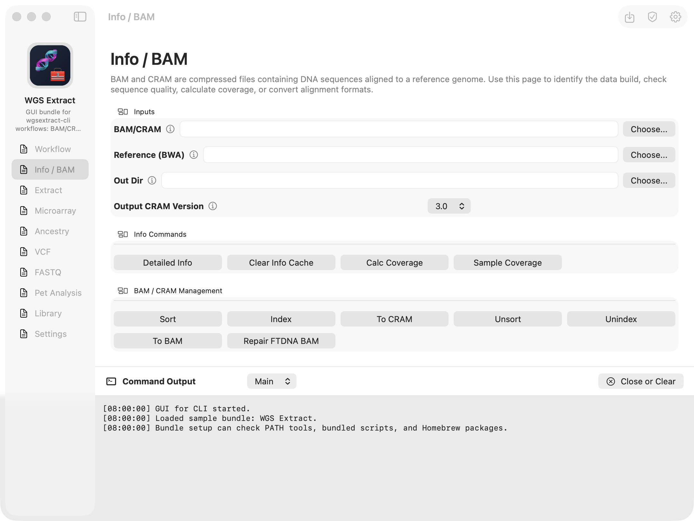

# GUI for CLI

> [!WARNING]
> This project is a work in progress. The bundle schema, setup flow, and app UI are still changing and should not be treated as stable.

A SwiftUI starter app for building GUI front ends from small CLI-tool bundles.



## Features

- **Language:** Swift 6 with Swift Package Manager as the source of truth.
- **CLI:** `swift-argument-parser` with `precheck`, `config`, and `run` subcommands.
- **Apps:** Shared SwiftUI code for macOS first, with the iOS target retained for later support.
- **Web UI:** A local browser renderer for the same bundle manifest, page JSON, and localization tables.
- **Bundles:** Codable JSON bundle/page/action/setup models with folder and archive loading.
- **Prototype UI:** Sidebar pages, form controls, action button rows, tooltips, and a global terminal-log pane with tabs.
- **Configuration:** JSON config in platform-standard Application Support paths with validation and redaction.
- **Quality:** `swift-format`, Swift Testing, release builds, app builds, and GitHub Actions CI.
- **Agent Friendly:** Includes `AGENTS.md`, `CLAUDE.md`, and `GEMINI.md` for AI-assisted development.

## Requirements

- Xcode 16 or newer with Swift 6.
- `swift-format`, available through recent Xcode toolchains as `swift format`.
- [Tuist](https://tuist.dev) for app workspace generation: `curl -Ls https://install.tuist.io | bash`.
- Node.js 18 or newer for the optional local Web UI.
- Optional: [mise](https://mise.jdx.dev) can install the pinned Tuist version from `.mise.toml`.
- GitHub CLI is optional, but `scripts/dev-register.py` uses it when available.

## Getting Started

1. Install dependencies:
   ```bash
   swift package resolve
   ```
2. Run precheck:
   ```bash
   swift run gui-for-cli precheck
   ```
3. Initialize config:
   ```bash
   swift run gui-for-cli config init
   ```
4. Set up local development identity and hooks:
   ```bash
   make setup-dev
   ```
5. Run the CLI:
   ```bash
   swift run gui-for-cli run --name Swift
   ```
6. Generate the Xcode workspace:
   ```bash
   make project
   open GUIForCLI.xcworkspace
   ```

### Integrated app builds

The default app keeps the general `GUI for CLI` identity. For a more integrated bundle-specific build,
write a local, ignored identity config before generating the project:

```bash
mkdir -p tmp
printf '{ "embeddedBundlePath": "Examples/WGSExtract" }\n' > tmp/app-identity.json
./scripts/tuist.sh clean manifests
./scripts/tuist.sh generate --no-open
```

`embeddedBundlePath` reads `manifest.json` and uses its `displayName` for `CFBundleDisplayName`,
`CFBundleName`, and the built `.app` product name. You can also set `displayName` and `productName`
directly in `tmp/app-identity.json`. App icons remain asset catalog resources, so an integrated build
should also provide or replace the desired `AppIcon` assets. Delete `tmp/app-identity.json` and regenerate
after `./scripts/tuist.sh clean manifests` to return to the general app identity.

## Common Commands

- `make lint`: run `swift-format` lint checks.
- `make format`: format Swift source files in place.
- `make test`: run Swift package tests.
- `make build-cli`: build the release CLI.
- `make validate-bundles`: validate `Examples/*` bundles (`STRICT=1` uses release profile checks).
- `make webui`: run the local Web UI for `Examples/WGSExtract` (override with `BUNDLE=... PORT=...`).
- `make test-webui`: build and run the Web UI TypeScript tests.
- `make build-ios`: generate and build the iOS app for a simulator destination.
- `make build-macos`: generate and build the macOS app.
- `make precheck`: verify the local Apple development environment.
- `make ci`: run the full CI pipeline locally (mirrors `.github/workflows/ci.yml`).
- `make ci-fast`: same as `make ci` but skips the iOS build for a quick pre-push check.

## Configuration

Configuration is stored at:

```text
$HOME/Library/Application Support/gui-for-cli/config.json
```

For isolated tests or scripts, set `GUI_FOR_CLI_CONFIG_DIR` to override the config directory.

View config:

```bash
swift run gui-for-cli config show
```

Overwrite config with defaults:

```bash
swift run gui-for-cli config init --force
```

## Bundles

A bundle is a folder or supported archive containing a `manifest.json`. The loader accepts:

- A folder containing `manifest.json`.
- A folder/archive containing one top-level child folder with `manifest.json`.
- A direct `manifest.json` file.
- `.zip`, `.tar`, `.tar.gz`, `.tgz`, and single-manifest `.gz` files on macOS.

Inspect the included example:

```bash
swift run gui-for-cli bundle inspect Examples/WGSExtract
```

Preview setup commands for a bundle:

```bash
swift run gui-for-cli bundle setup --dry-run Examples/WGSExtract
```

Run strict release-profile validation across shipped bundles:

```bash
swift run gui-for-cli bundle validate --profile release Examples/*
```

Create a copy of the example bundle:

```bash
swift run gui-for-cli bundle write-demo tmp/WGSExtract.gui-cli --force
```

Bundles can include a `strings.toml` file next to `manifest.json`. It is a flat key/value table:
GUI-facing strings in `manifest.json` are keys, and the loader replaces each key with the matching
value. If a key is missing, the app renders the key itself. Additional language tables use
`strings.<language-code>.toml`; they override `strings.toml` and fall back to it for missing keys.
Add a `language.name` entry to each table to label it in the app's Settings language picker.

```toml
"language.name" = "English"
"language.layoutDirection" = "ltr"
"language.setting.title" = "Interface Language"
"language.setting.label" = "Language"
"app.terminal.mainTab.title" = "Main"
"app.pathPicker.chooseButton.title" = "Choose..."
"bundle.displayName" = "My Tool"
"bundle.summary" = "A localized description."
"pages.main.title" = "Main"
"pages.main.summary" = "Run common commands."
"controls.main.inputs.input-file.tooltip" = "File to process."
"actions.main.commands.run.tooltip" = "Run the CLI with the current inputs."
```

### JSON schema

Schema files live in `docs/schema/manifest.schema.json` and `docs/schema/page.schema.json`.

Top-level fields:

```json
{
  "id": "my-tool",
  "displayName": "bundle.displayName",
  "summary": "bundle.summary",
  "iconName": "terminal",
  "iconPath": "Assets/icon.png",
  "iconEmoji": "🧰",
  "sidebarIconStyle": "automatic",
  "terminalTextDirection": "ltr",
  "exitCodeReference": [
    {
      "code": 127,
      "title": "exitCodes.my-tool.127.title",
      "summary": "exitCodes.my-tool.127.summary",
      "severity": "error"
    }
  ],
  "pages": ["main.json", "settings.json"]
}
```

`iconPath` is optional and resolves relative to the bundle root. If no image is present, the app can render
`iconEmoji` into generated icon artwork, then falls back to `iconName` as an SF Symbol.
`sidebarIconStyle` controls what appears above the sidebar: `automatic`, `image`, `emoji`, `symbol`, or
`hidden`. `pages` is normally an ordered list of file names under the bundle's `pages/` directory; each page
file contains one page object. Legacy inline page objects are still accepted.
The app provides generic exit-code references for common process statuses. `exitCodeReference` is optional;
bundle entries with the same `code` override those defaults. Titles and summaries participate in
`strings.toml` localization just like page labels, and failed command tabs show the blurb before the command
and exit-code detail.

Setup steps use `setupScript`/`bundledScript`, `pathTool`, `homebrewPackage`, `pixiInstall`, or `pixiRun`.
Scripts and working directories must stay inside the bundle. Arguments and environment values can use
`{{bundleRoot}}` interpolation. Config editors can also opt into setup-time settings bootstrap so a missing
TOML file is created before setup commands run.

```json
{
  "setup": {
    "steps": [
      { "id": "pixi", "kind": "pathTool", "label": "setup.pixi.label", "value": "pixi", "optional": true },
      {
        "id": "install",
        "kind": "setupScript",
        "label": "setup.install.label",
        "value": "scripts/setup.sh",
        "environment": { "INSTALL_DIR": "{{bundleRoot}}/runtime/my-tool" }
      },
      {
        "id": "deps-check",
        "kind": "pixiRun",
        "label": "setup.deps-check.label",
        "value": "deps-check",
        "workingDirectory": "runtime/my-tool/app",
        "optional": true
      }
    ]
  }
}
```

Page files contain sections, sections contain controls and actions, and actions contain commands:

```json
{
  "id": "main",
  "title": "pages.main.title",
  "summary": "pages.main.summary",
  "iconName": "hammer",
  "sidebarGroup": "pages.groups.convert",
  "sections": [
    {
      "id": "inputs",
      "title": "sections.main.inputs.title",
      "iconEmoji": "🧰",
      "controls": [
        {
          "id": "input-file",
          "label": "controls.main.inputs.input-file.label",
          "kind": "path",
          "tooltip": "controls.main.inputs.input-file.tooltip"
        }
      ],
      "actions": [
        {
          "id": "run",
          "title": "actions.main.inputs.run.title",
          "tooltip": "actions.main.inputs.run.tooltip",
          "iconName": "play.fill",
          "command": { "executable": "my-cli", "arguments": ["run"] }
        }
      ]
    }
  ]
}
```

Pages, sections, and actions can use `"iconName"` for SF Symbols or `"iconEmoji"` for emoji. Pages can set
`"sidebarGroup"` to group related pages under a sidebar section heading. Actions can also set
`"iconOnly": true` while keeping `title` for tooltips and accessibility.

Additional generic controls can model richer CLI surfaces:

```json
{
  "id": "reference-library",
  "label": "controls.reference-library.label",
  "kind": "libraryList",
  "dataSource": {
    "path": "scripts/list-reference-library.sh",
    "arguments": ["items", "{{reference-library-path}}"]
  },
  "columns": [
    { "id": "name", "title": "columns.reference-library.name.title" },
    { "id": "status", "title": "columns.reference-library.status.title" }
  ],
  "rowTemplate": {
    "id": "{{id}}",
    "title": "{{name}}",
    "status": "{{status}}",
    "values": { "status": "{{status}}" }
  },
  "items": [
    { "id": "hg38", "name": "rows.reference-library.hg38.title", "status": "installed" }
  ],
  "rowActions": [
    {
      "id": "verify",
      "title": "actions.reference-library.verify.title",
      "iconName": "checkmark.seal",
      "iconOnly": true,
      "visibleWhen": [{ "placeholder": "row.status", "in": ["installed", "unindexed"] }],
      "disabledWhen": [{ "placeholder": "row.locked", "equals": "true" }],
      "disabledTooltip": "This row is currently locked.",
      "confirm": {
        "title": "Verify {{row.id}}?",
        "message": "This will inspect the selected reference genome.",
        "confirmButtonTitle": "Verify"
      },
      "command": { "executable": "my-cli", "arguments": ["library", "verify", "{{row.id}}"] }
    }
  ]
}
```

```json
{
  "id": "tool-settings",
  "label": "controls.tool-settings.label",
  "kind": "configEditor",
  "configFile": {
    "path": "{{home}}/.config/my-tool/config.toml",
    "format": "toml",
    "bootstrap": {
      "mode": "createIfMissing",
      "script": {
        "path": "scripts/bootstrap-config.sh",
        "arguments": ["{{bundleWorkspace}}", "{{configPath}}"]
      }
    }
  },
  "settings": [
    {
      "id": "output-dir",
      "key": "output_dir",
      "label": "settings.output-dir.label",
      "kind": "path"
    }
  ]
}
```

`libraryList` renders a table with per-row actions. Use `rows` for fully authored static rows, or
`rowTemplate` plus `items` to define the row shape once and hydrate it from item data. Controls, sections, and
`configEditor` settings may also declare `dataSource` to run a bundled script that prints JSON. The app
passes `GUI_FOR_CLI_BUNDLE_ROOT`, `GUI_FOR_CLI_BUNDLE_WORKSPACE`, `GUI_FOR_CLI_FIELD_<ID>`, and
`GUI_FOR_CLI_CONFIG_<KEY>` environment values, plus `GUI_FOR_CLI_DATA_SOURCE=1`; script arguments and
environment values can use the same `{{...}}` placeholders as commands. Data-source `path` and
`workingDirectory` must be literal relative paths inside the bundle/workspace, not `~/`, absolute paths,
`..`, or template-expanded paths. Dropdown data sources should print
`{"options":[{"id":"value","title":"Label"}]}`. Library-list data sources should print
`{"items":[{"id":"hg38","title":"HG38","status":"installed","tags":[{"title":"Recommended","style":"primary"}],"values":{"build":"GRCh38"}}]}`
and may also print `rowActions` to replace static row actions. Static `options`, `items`, and `rowActions`
remain as fallbacks if the script cannot be loaded. Row `status` and `tags` render as compact pills; tag
styles are `primary`, `secondary`, `success`, `warning`, and `danger`. Row action commands can use
`{{row.id}}` and `{{row.<value>}}` placeholders, plus regular control placeholders like `{{output-dir}}`.
Section data sources can print `{"values":{"tool.installed":"true"}}`; those values are available to that
section's action commands, `visibleWhen`, and `disabledWhen` conditions. When one of that section's action
commands finishes, the section reloads its data source so script-backed button state reflects the completed
operation.
Actions may include `visibleWhen` conditions to hide row buttons when a placeholder does not match, and
`disabledWhen` plus `disabledTooltip` to leave a button visible but unavailable with an explanation. Each
condition supports `equals`, `notEquals`, `in`, `notIn`, or `exists`. Destructive or sensitive actions can
declare `confirm` with `title`, `message`, button titles, and optional `requiredText`; all confirmation text
can use the same placeholders as commands.
Data-source scripts should finish quickly, write UTF-8 JSON to stdout, and write human-readable failures to
stderr before exiting non-zero. The app drains stdout/stderr while the script runs, caps retained output for
error reporting, cancels stale loads when inputs change, and times out scripts that do not finish promptly.
Action buttons stay disabled until every `{{...}}` placeholder in their required command arguments resolves
to a non-empty value. Commands can also define `optionalArguments` as argument groups that are appended only
when every placeholder in that group has a value. Conditions and commands can also read
`{{fieldID.pathExtension}}` for path controls, which returns the lowercased selected file extension. `{{bundleRoot}}`
and `{{bundleWorkspace}}` both resolve to the active writable bundle location for action commands. On macOS,
action commands are launched as processes in the bundle root and stream output into terminal tabs. Info buttons
open clickable popover help while still supporting system hover help.
`configEditor` renders editable settings and writes a simple TOML file. Its settings-file path can use
`{{bundleRoot}}`, `{{bundleWorkspace}}`, `{{home}}`, `{{configHome}}`, `{{userConfig}}`,
`{{applicationSupport}}`, `{{appConfig}}`, or `~/`, can be edited or chosen with the native picker, and is
retained per bundle/control. Add `"bootstrap": { "mode": "createIfMissing" }` to create a missing settings
file from the declared settings defaults when the bundle first loads and when `bundle setup` runs; use
`"mergeMissing"` to add newly declared keys to an existing file.

## Web UI

Run a local browser version of the data-driven UI with:

```bash
make webui
```

The Web UI serves the same bundle manifest, page JSON files, `strings/*.toml` localization tables, controls,
library lists, action buttons, command interpolation, script-backed data sources, bundle assets, and TOML
settings editors. It uses a local Node server so browser-safe UI code can delegate local process execution and
filesystem access to `127.0.0.1`.

The Web UI source lives under `WebUI/src` as TypeScript and compiles to the gitignored `WebUI/dist` directory
before running. Use `npm --prefix WebUI install` once to install the TypeScript toolchain if dependencies have
not already been restored.

Bootstrap can also be driven by a bundled script. The script runs with `GUI_FOR_CLI_BUNDLE_WORKSPACE`,
`GUI_FOR_CLI_CONFIG_PATH`, and `GUI_FOR_CLI_CONFIG_DIR` in its environment, and its arguments/environment can
use the same path tokens plus `{{configPath}}` and `{{configDir}}`. It must print JSON to stdout with either
`contents`, `contentsPath`, or `values`, and may override the destination with `path`, for example:
`{"path":"{{bundleWorkspace}}/config.toml","values":{"output_dir":""}}`.

Settings whose `key` or `id` matches a normal control ID share the same value, so updating something like
`ref_path` on another page updates the settings editor too. Control kinds currently supported by the renderer
are `text`, `path`, `dropdown`, `toggle`, `checkboxGroup`, `infoGrid`, `libraryList`, and `configEditor`;
`path` controls include a native file/directory picker. Action roles are `primary`, `secondary`, and
`destructive`.

## Git Hooks

Git does not automatically install hooks from a cloned repository. Opt in locally with:

```bash
make setup-dev
```

The installed `pre-commit` hook verifies your `.dev_id` and runs formatting lint. The `pre-push` hook verifies identity and runs `make ci-fast`, which mirrors the GitHub Actions workflow (lint, locale lint, bundle validate, tests, CLI build, Tuist generate, macOS build) so push-time failures match CI.
