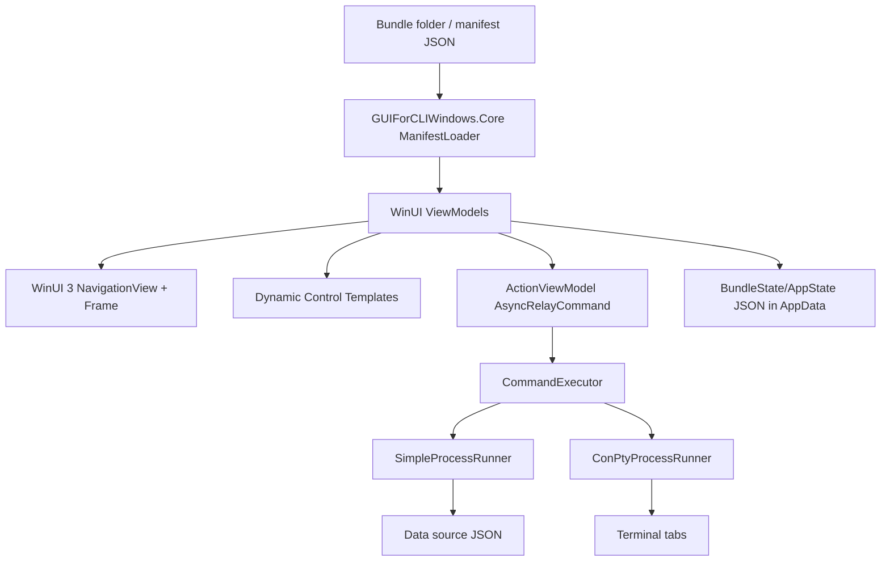
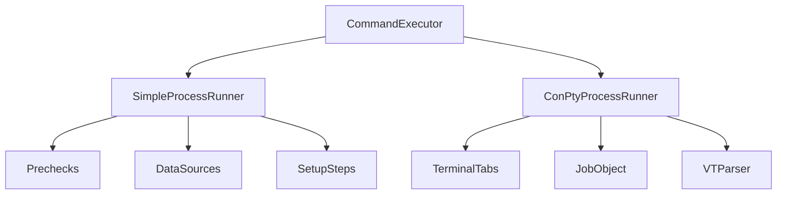

# Native Windows implementation plan for gui-for-cli

## Executive summary

The best Windows implementation for gui-for-cli is a **native C# WinUI 3 app on the Windows App SDK**, backed by a Windows-specific .NET core library that consumes the same JSON manifest contract as the existing SwiftUI macOS app and the complete TypeScript WebUI implementation.[^1] This is the only option that satisfies the product goal of feeling like a first-class Windows app instead of a WebUI wrapper: WinUI 3 gives Fluent controls, NavigationView, Mica/Acrylic-capable chrome, native UI Automation accessibility, automatic DPI behavior, and direct Windows process integration.[^2]

Do **not** build the first Windows product as Electron, Tauri, or a WebView2 shell. Those paths can be practical fallback or bootstrap options, but they fail the explicit goal: if the UI is web-rendered, the existing WebUI already covers that direction.[^3] Do **not** bet the production app on Swift UI bindings for Windows yet; Swift on Windows is viable for CLI/core code, but Swift WinUI bindings and COM/WinRT interop are still preview-risky compared with C# WinUI 3.[^4]

The recommended architecture is: **Windows app = C# WinUI 3 + MVVM Toolkit + System.Text.Json models mirroring the manifest schema + Windows process services**. The **WebUI implementation should be treated as the primary behavioral reference** because `WebUI\src\shared\rendering.ts` and `WebUI\src\shared\localization.ts` already encode the JSON-native runtime behavior independently from Swift.[^5] Reuse the manifest files, localization keys, examples, and cross-platform test fixtures as the contract; avoid sharing Swift code, Swift binaries, or the Swift runtime with the Windows implementation.

## Decision

### Adopt

**C# WinUI 3 / Windows App SDK** for the native Windows UI.

Use:

| Layer | Recommendation |
|---|---|
| UI shell | WinUI 3 `NavigationView` + `Frame` + `TabView` |
| Dynamic controls | `DataTemplateSelector` over typed view-models |
| State and binding | CommunityToolkit.Mvvm (`ObservableObject`, `ObservableValidator`, `AsyncRelayCommand`) |
| Manifest parsing | C# records/classes with `System.Text.Json`, kept in parity with the WebUI JSON behavior and cross-checked against Swift `Codable` models |
| Terminal/process output | Two-runner design: simple redirected `Process` for data sources; ConPTY for terminal action tabs |
| Packaging | Self-contained WinUI 3 publish for no runtime prerequisite; MSIX or signed installer for distribution |
| Accessibility | UI Automation via `AutomationProperties`, stable `AutomationId`s, live regions, high-contrast theme resources |

### Reject for primary implementation

| Option | Why not primary |
|---|---|
| WPF | Stable and deploys easily, but visually older, weaker Windows 11/Fluent fit, no native Mica/Acrylic, more DPI/theming work.[^6] |
| Electron | Bundles Chromium/Node and is just a packaged WebUI; large and not native.[^7] |
| Tauri/WebView2 wrapper | Better than Electron but still web-rendered, so it does not beat the existing WebUI on native UX.[^8] |
| .NET MAUI | Uses WinUI 3 under the hood but adds an abstraction layer with no benefit because macOS already has SwiftUI.[^9] |
| React Native Windows | Native-ish controls but adds JavaScript bridge complexity and weaker terminal/process story.[^10] |
| Qt/Flutter | Self-contained, but custom-rendered/non-Fluent UI and poorer fit for native Windows accessibility/design goals.[^11] |
| Swift + WinUI bindings | Promising long-term, but current Swift WinRT/WinUI bindings are preview quality and add runtime/tooling risk.[^12] |

## WebUI is the behavioral reference

The Windows implementation should **not ignore the WebUI**. The WebUI is not merely a browser alternative; it is an existing complete implementation of the data-driven bundle GUI runner. Its shared TypeScript layer is especially important because it contains platform-neutral behavior with no DOM or Node dependency.[^5]

Use these WebUI files as the primary C# parity targets:

| WebUI file | Windows implementation responsibility |
|---|---|
| `WebUI\src\shared\rendering.ts` | Placeholder interpolation, rendered commands, optional arguments, missing placeholders, action visibility/disabled logic, condition evaluation, row hydration, data-source payload merge semantics, flat TOML parsing/serialization, numeric expression evaluation |
| `WebUI\src\shared\localization.ts` | TOML string-table parsing, localization label defaults, manifest localization, table merge order |
| `WebUI\src\client\view.ts` | Complete rendering behavior for text/path/dropdown/toggle/checkboxGroup/infoGrid/libraryList/configEditor, page/section/action/terminal layout, confirmation dialog behavior |
| `WebUI\src\client\operations.ts` | Data-source refresh, action execution, precheck workflow, file-state refresh, bundle-state persistence, config save flow |
| `WebUI\src\server\main.ts` | API surface that describes all runtime operations the app needs |
| `WebUI\src\server\action-runner.ts` | File-state values, disk precheck, action command execution behavior |
| `WebUI\src\server\config-store.ts` | Bundle state, config binding, TOML config load/save behavior |
| `WebUI\src\server\bundle-loader.ts` | Page-file loading, string-table layering, exit-code defaults |
| `WebUI\src\server\process-runner.ts` | Process execution semantics to preserve, with Windows process-tree behavior replaced by native Job Objects |

The Windows code should be tested against WebUI behavior, not against Swift implementation details. The Swift app remains an important macOS reference, but C# should replicate the **JSON/runtime contract** demonstrated by WebUI.

## Architecture overview



Recommended repository shape:

```text
Apps\
  Windows\
    GUIForCLIWindows\
      App.xaml
      MainWindow.xaml
      Views\
      Controls\
      Styles\
Sources\
  GUIForCLIWindows.Core\
    Models\
    Manifest\
    Rendering\
    Process\
    Storage\
    Localization\
Tests\
  GUIForCLIWindows.CoreTests\
  GUIForCLIWindows.UITests\
```

Keep reusable business rules outside the WinUI project so view-models and manifest/rendering tests can run without a UI host.

## Manifest, behavior, and model strategy

The existing schema is already the strongest cross-platform contract: manifests define pages, sections, controls, actions, commands, data sources, setup steps, localization keys, bundle state, and terminal behavior.[^13] The Windows implementation should not call Swift code directly and should not link or ship any Swift runtime. Instead:

1. Mirror the **WebUI TypeScript model and behavior** as C# models/services using the same JSON property names, cross-checking against the Swift `Codable` models only to catch schema drift.
2. Port the platform-neutral behavior from `WebUI\src\shared\rendering.ts`: `interpolate`, `contextValue`, `renderedCommand`, `missingPlaceholders`, `conditionMatches`, `isActionVisible`, `disabledReason`, `hydrateRows`, `rowContext`, `applyDataSourcePayload`, `parseFlatToml`, `serializeFlatToml`, and `evaluateNumeric`.
3. Port the localization behavior from `WebUI\src\shared\localization.ts`: TOML parsing, label defaults, string-table layering, and deep manifest localization.
4. Add shared JSON fixtures from `Examples\` and tests that assert TypeScript and C# produce the same rendered command, condition, row hydration, localization, TOML, and data-source payload results.
5. Introduce `manifest.schema.json` as the long-term source of truth, then generate or validate Swift/C#/TypeScript models from it.
6. Treat SF Symbol names as semantic icon IDs and add a Windows icon mapping table to Segoe Fluent Icons.

This mirrors the WebUI precedent: the TypeScript implementation already consumes the same manifest independently instead of linking Swift runtime code.[^14]

Built-in localization files currently live under the Swift package tree. The Windows implementation should not read from `Sources\GUIForCLICore` at runtime; move or copy those TOML resources into a platform-neutral shared resource location during the build so C#, Swift, and WebUI all consume the same data without implying Swift code sharing.

## WinUI rendering design

### Shell

Use `NavigationView` for bundle pages and `Frame` for the selected page. `sidebarGroup` maps to `NavigationViewItemHeader`; page rows map to `NavigationViewItem` with `AutomationProperties.Name` and stable automation IDs.[^15]

### Pages and sections

Render a page as a `ScrollViewer` containing section cards. WinUI 3 does not have a direct `GroupBox`; compose sections with `Border`, `TextBlock` headings, and `StackPanel`/`ItemsRepeater`, adding `AutomationProperties.HeadingLevel="Level2"` and a named landmark.[^16]

### Controls

Use a `DataTemplateSelector` keyed by `ControlKind`.

| Manifest `kind` | WinUI control |
|---|---|
| `text` | `TextBox` |
| `path` | `TextBox` + native file/folder picker button |
| `dropdown` | `ComboBox` |
| `toggle` | `ToggleSwitch` |
| `checkboxGroup` | `ListView` or `ItemsRepeater` of `CheckBox` |
| `infoGrid` | read-only `Grid`/`ItemsRepeater` |
| `libraryList` | `ListView` initially; DataGrid if large/sortable tables are required |
| `configEditor` | generated form rows, TOML load/save service |

`configEditor` has its own nested setting kinds (`text`, `path`, `dropdown`, `toggle`) in the WebUI renderer. The WinUI implementation needs templates both for the outer `configEditor` control and for each `settings[]` row.

Prefer typed view-models over late-bound dictionaries so `{x:Bind}` can catch binding mistakes at compile time. Use runtime `{Binding}` only where dynamic row dictionaries make typed binding impractical.[^17]

### Actions

Represent every `ActionSpec` as an `ActionViewModel` with an `IAsyncRelayCommand`. `CanExecute` should reflect missing placeholders, `disabledWhen`, precheck state, and running state. Confirmation maps to `ContentDialog`; destructive actions use a dedicated style based on WinUI theme resources, not hard-coded red.[^18]

## Process and terminal architecture

Windows needs a different process model than macOS. Use two runners:



### SimpleProcessRunner

Use `System.Diagnostics.Process` with `UseShellExecute=false`, `ArgumentList`, redirected stdout/stderr, timeout, and cancellation. Use it for data sources, setup checks, config scripts, and short non-interactive commands.[^19]

The existing WebUI process runner is useful as a behavioral reference, but not as a Windows process implementation. Its Windows descendant-process lookup currently returns an empty list, so the native Windows implementation should use Job Objects rather than porting the Node process-tree logic.

### ConPtyProcessRunner

Use ConPTY (`CreatePseudoConsole`) for action commands displayed in terminal tabs. ConPTY is the Windows PTY equivalent and is available starting Windows 10 1809, matching the Windows App SDK minimum.[^20]

### Quoting and shell routing

Never port POSIX shell quoting to Windows. Use `ProcessStartInfo.ArgumentList` for actual execution. Route by file type:

| Executable type | Route |
|---|---|
| `.exe` | direct process |
| `.ps1` | `pwsh.exe` or `powershell.exe -NoProfile -NonInteractive -ExecutionPolicy Bypass -File` |
| `.cmd` / `.bat` | `cmd.exe /c` |
| shell built-ins | explicit `cmd.exe /c` or PowerShell command |

### Cancellation

Use Windows Job Objects with `JOB_OBJECT_LIMIT_KILL_ON_JOB_CLOSE` for reliable process-tree cleanup. For ConPTY, send Ctrl+C (`\x03`) first, then terminate the job if the process does not exit promptly.[^21]

## Storage, setup, and Windows-specific behavior

Use `%LOCALAPPDATA%\gui-for-cli` for non-roaming bundle workspaces and `%APPDATA%` only if roaming state is explicitly desired. The current WebUI server path logic has no dedicated `win32` branch in `WebUI\src\server\paths.ts`, so on Windows it falls through to the non-Darwin XDG path. If the WebUI server remains runnable on Windows for development, update it to match the C# implementation's `%LOCALAPPDATA%\gui-for-cli` workspace root.[^22]

Add Windows-native setup kinds:

| Setup need | Windows support |
|---|---|
| tool on PATH | `where.exe` or direct PATH search |
| package check | `winget list` where applicable |
| setup script | `powershellScript` (`.ps1`) |
| pixi | direct `pixi.exe` commands |

Do not require WSL, Git Bash, Homebrew, Node, or any POSIX runtime for end users.

## Deployment plan

No-extra-runtime install is achievable with WinUI 3 by using both:

1. `<WindowsAppSDKSelfContained>true</WindowsAppSDKSelfContained>` for Windows App SDK dependencies.
2. .NET self-contained publish for the .NET runtime.[^23]

Recommended distribution:

| Channel | Package |
|---|---|
| Developer/internal | self-contained unpackaged folder or signed installer |
| Beta/public | signed MSIX with `.appinstaller` update feed |
| Store-ready | MSIX Store submission |
| Enterprise fallback | signed MSI/EXE via WiX/Inno/NSIS if MSIX is blocked |

Code signing matters: unsigned or low-reputation Windows binaries trigger SmartScreen / Smart App Control friction. Store distribution avoids most signing friction; non-Store builds should use trusted signing.[^24]

## Accessibility requirements

Windows accessibility should be first-class, not a post-port audit. Map existing accessibility identifiers directly to UIA `AutomationId` values.[^25]

Release-blocking checklist:

1. Every focusable control has `AutomationProperties.Name` from manifest label/title.
2. Icon-only controls set explicit names and help text.
3. Pages and sections expose heading levels.
4. Sidebar and main content expose landmarks.
5. Dynamic loading/error text uses UIA live regions.
6. Tab order follows manifest order; F6 cycles between sidebar/content/terminal panes.
7. Library rows and per-row actions include row context in accessible names.
8. All colors use `{ThemeResource}`/system resources and pass high-contrast checks.
9. Accessibility Insights FastPass and Narrator smoke tests are part of release validation.

## Implementation phases

## Execution progress

The first executable Windows slice is now in the repository:

- `GUIForCLIWindows.sln`
- `Apps\Windows\GUIForCLIWindows`
- `Sources\GUIForCLIWindows.Core`
- `Tests\GUIForCLIWindows.CoreTests`
- `make build-windows`, `make build-windows-core`, and `make test-windows-core`

Implemented core services cover the platform-neutral WebUI behavior that should stay shared by contract rather than by runtime:

- manifest models, split page loading, string table loading, and manifest localization
- placeholder interpolation, command rendering, optional arguments, missing placeholder detection, action visibility/disabled reasons, numeric conditions, row hydration, row context, and data-source payload merge semantics
- flat TOML parse/serialize and localization TOML parsing
- initial field, checked option, and config state computation
- native Windows app paths under `%LOCALAPPDATA%\gui-for-cli` / `%APPDATA%\gui-for-cli`
- bundle state persistence, config-file path persistence, and configEditor TOML load/save
- simple redirected process runner using `ProcessStartInfo.ArgumentList`
- Windows command routing for direct executables, `.ps1`, `.cmd`, `.bat`, Python scripts, and WGSExtract `.sh` entries with sibling `.ps1` routing
- WinUI 3 NavigationView shell, self-contained Windows App SDK setting, package manifest cleanup, and a native manifest-driven `Examples\WGSExtract` page through the C# core
- shared `manifest.schema.json` contract plus C# schema/fixture validation
- platform-neutral builtin string resources under `Resources\BuiltinStrings`
- action confirmation dialogs with required-text prompts
- semantic icon to Segoe Fluent glyph mapping
- Windows setup step command mapping for `powershellScript`, `wingetPackage`, `pixi`, and existing WGSExtract setup kinds
- Windows Job Object process-tree cleanup support and a ConPTY runner boundary for terminal execution
- MSIX package script with optional signing, Windows GitHub Actions workflow, and static UIA accessibility smoke automation

Current validation covers synthetic WebUI parity cases plus the real `Examples\WGSExtract` split manifest and localization fixture, Windows build/test/publish/package automation, WebUI parity checks, and static Windows UIA accessibility smoke checks.

### Phase 1: Establish Windows core project

- Add `Sources\GUIForCLIWindows.Core`.
- Add C# model mirrors for manifest, pages, sections, controls, actions, commands, data sources, config, and state based on the WebUI JSON model and cross-checked with Swift models.
- Port WebUI shared behavior into C# services with direct parity tests for `rendering.ts` and `localization.ts`.
- Add fixture-based parity tests using existing example bundles and WebUI test cases.
- Add Windows App SDK / WinUI 3 project with an empty shell.

### Phase 2: Native shell and manifest rendering

- Implement `NavigationView` sidebar, `Frame` page host, section renderer, and `ControlKind` template selector.
- Implement basic controls: text, path, dropdown, toggle, checkbox group.
- Add app state and bundle state persistence under LocalAppData.
- Add icon mapping table from current semantic icon names to Fluent glyphs.

### Phase 3: Actions, data sources, and terminal tabs

- Implement `CommandRenderContext`/placeholder resolution in C#.
- Implement `SimpleProcessRunner` for data sources/prechecks.
- Implement action buttons with `AsyncRelayCommand`, `ContentDialog` confirmation, disabled reasons, and prechecks.
- Implement terminal tabs with append-only output first; add ConPTY-backed runner next.

### Phase 4: Full Windows process semantics

- Add ConPTY runner, VT/ANSI parser or xterm/WebView2-backed terminal component if full terminal fidelity is required.
- Add Job Object lifecycle manager.
- Add Windows shell routing for `.exe`, `.ps1`, `.cmd`, `.bat`.
- Add PATH/environment resolver for GUI-launched apps.

### Phase 5: Setup, config editor, and advanced controls

- Add Windows setup step kinds (`powershellScript`, `wingetPackage`) and docs.
- Implement `configEditor` with TOML parsing/writing.
- Implement `libraryList` with virtualization and row actions.
- Add Windows example bundle using PowerShell scripts.

### Phase 6: Packaging and CI

- Add Windows build/test workflow on `windows-latest`.
- Publish self-contained WinUI 3 artifacts.
- Add MSIX packaging and signing.
- Add accessibility smoke tests using Accessibility Insights, Inspect/UIA, or WinAppDriver/Appium.

All phase items above are now represented in the repository. Full interactive terminal emulation still uses the append-only terminal surface documented in the MVP notes, but the Windows process architecture now has the ConPTY-specific runner boundary and native entrypoint check needed to replace that surface without changing the rest of the app.

## Risks and mitigations

| Risk | Mitigation |
|---|---|
| Schema drift across Swift/C#/TypeScript | Add shared JSON Schema and cross-platform fixtures. |
| WinUI DataGrid dependency | Start with `ListView`; introduce toolkit DataGrid only when large sortable tables require it. |
| Terminal fidelity complexity | Ship append-only VT-stripped log first; add ConPTY + parser/xterm path after command execution is stable. |
| Windows setup scripts differ from macOS | Explicit platform-specific setup kinds and examples; no POSIX fallback. |
| SmartScreen friction | Sign all public artifacts; prefer Store/MSIX for distribution. |
| Accessibility regressions in generated UI | Stable AutomationIds plus automated name/live-region/high-contrast checks. |

## Confidence assessment

High confidence: WinUI 3 is the right primary native Windows UI direction; C# is the pragmatic implementation language; self-contained deployment can satisfy the no-extra-runtime goal; ConPTY/Job Objects are the correct terminal/process primitives; UI Automation maps well to the existing manifest-driven accessibility model.

Medium confidence: exact package size and publish mechanics should be validated with a prototype because WinUI 3 self-contained deployment has changed across Windows App SDK releases. The terminal renderer choice should be decided after measuring whether append-only output is sufficient for gui-for-cli’s expected commands.

Low confidence / deliberately deferred: Swift WinUI as the production UI stack. Swift on Windows is improving, but the UI/COM ecosystem is not yet mature enough to be the safest path for this app.

## Footnotes

[^1]: Research subagent `win-native-options`, `C:\Users\mac\AppData\Local\Temp\1778344032241-copilot-tool-output-m6pvqg.txt:47-139`; research subagent `winui-deep-dive`, `C:\Users\mac\AppData\Local\Temp\1778345811005-copilot-tool-output-2czpqc.txt:7-15`.
[^2]: Microsoft Learn, WinUI 3 overview: https://learn.microsoft.com/en-us/windows/apps/winui/winui3/; research subagent `wpf-comparison`, `C:\Users\mac\AppData\Local\Temp\1778346139629-copilot-tool-output-f599it.txt:77-98`.
[^3]: Research subagent `repo-architecture`, `C:\Users\mac\AppData\Local\Temp\1778344303158-copilot-tool-output-jvrnof.txt:282-309`; research subagent `win-native-options`, `C:\Users\mac\AppData\Local\Temp\1778344032241-copilot-tool-output-m6pvqg.txt:291-337`.
[^4]: Research subagent `swift-windows-interop`, `C:\Users\mac\AppData\Local\Temp\1778345505801-copilot-tool-output-ckx9tn.txt:30-55,171-240,244-260,316-367`.
[^5]: Research subagent `repo-architecture`, `C:\Users\mac\AppData\Local\Temp\1778344303158-copilot-tool-output-jvrnof.txt:58-159,345-379`; research subagent `swift-windows-interop`, `C:\Users\mac\AppData\Local\Temp\1778345505801-copilot-tool-output-ckx9tn.txt:316-367`.
[^6]: Research subagent `wpf-comparison`, `C:\Users\mac\AppData\Local\Temp\1778346139629-copilot-tool-output-f599it.txt:5-8,58-98,219-264,417-451`.
[^7]: Research subagent `win-native-options`, `C:\Users\mac\AppData\Local\Temp\1778344032241-copilot-tool-output-m6pvqg.txt:291-305`.
[^8]: Research subagent `win-native-options`, `C:\Users\mac\AppData\Local\Temp\1778344032241-copilot-tool-output-m6pvqg.txt:309-337`; research subagent `win-deployment`, `C:\Users\mac\AppData\Local\Temp\1778344587506-copilot-tool-output-syi07e.txt:79-107,438-447`.
[^9]: Research subagent `win-native-options`, `C:\Users\mac\AppData\Local\Temp\1778344032241-copilot-tool-output-m6pvqg.txt:205-216`.
[^10]: Research subagent `data-driven-patterns`, `C:\Users\mac\AppData\Local\Temp\1778344957613-copilot-tool-output-fbozyy.txt:135-157`.
[^11]: Research subagent `win-native-options`, `C:\Users\mac\AppData\Local\Temp\1778344032241-copilot-tool-output-m6pvqg.txt:220-287`.
[^12]: Research subagent `swift-windows-interop`, `C:\Users\mac\AppData\Local\Temp\1778345505801-copilot-tool-output-ckx9tn.txt:171-240,263-295`.
[^13]: Research subagent `repo-architecture`, `C:\Users\mac\AppData\Local\Temp\1778344303158-copilot-tool-output-jvrnof.txt:62-159,188-229`.
[^14]: Research subagent `repo-architecture`, `C:\Users\mac\AppData\Local\Temp\1778344303158-copilot-tool-output-jvrnof.txt:282-309`.
[^15]: Research subagent `winui-deep-dive`, `C:\Users\mac\AppData\Local\Temp\1778345811005-copilot-tool-output-2czpqc.txt:50-156`.
[^16]: Research subagent `windows-accessibility`, `C:\Users\mac\AppData\Local\Temp\1778346769322-copilot-tool-output-f03y8w.txt:308-357,559-576`.
[^17]: Research subagent `data-driven-patterns`, `C:\Users\mac\AppData\Local\Temp\1778344957613-copilot-tool-output-fbozyy.txt:224-299,635-649`; research subagent `winui-deep-dive`, `C:\Users\mac\AppData\Local\Temp\1778345811005-copilot-tool-output-2czpqc.txt:159-255,524-560`.
[^18]: Research subagent `data-driven-patterns`, `C:\Users\mac\AppData\Local\Temp\1778344957613-copilot-tool-output-fbozyy.txt:301-397`; research subagent `winui-deep-dive`, `C:\Users\mac\AppData\Local\Temp\1778345811005-copilot-tool-output-2czpqc.txt:322-411`.
[^19]: Research subagent `terminal-process-layer`, `C:\Users\mac\AppData\Local\Temp\1778346465910-copilot-tool-output-5o5bgy.txt:40-76,332-375`.
[^20]: Microsoft Learn, Creating a pseudoconsole session: https://learn.microsoft.com/en-us/windows/console/creating-a-pseudoconsole-session; research subagent `terminal-process-layer`, `C:\Users\mac\AppData\Local\Temp\1778346465910-copilot-tool-output-5o5bgy.txt:79-163`.
[^21]: Research subagent `terminal-process-layer`, `C:\Users\mac\AppData\Local\Temp\1778346465910-copilot-tool-output-5o5bgy.txt:180-204,207-263,265-305`.
[^22]: Research subagent `repo-architecture`, `C:\Users\mac\AppData\Local\Temp\1778344303158-copilot-tool-output-jvrnof.txt:313-320`; research subagent `windows-roadmap`, `C:\Users\mac\AppData\Local\Temp\1778347176097-copilot-tool-output-996dnf.txt:626-665`.
[^23]: Research subagent `win-deployment`, `C:\Users\mac\AppData\Local\Temp\1778344587506-copilot-tool-output-syi07e.txt:39-64,122-146,184-220`; research subagent `win-native-options`, `C:\Users\mac\AppData\Local\Temp\1778344032241-copilot-tool-output-m6pvqg.txt:57-77,450-460`.
[^24]: Research subagent `win-deployment`, `C:\Users\mac\AppData\Local\Temp\1778344587506-copilot-tool-output-syi07e.txt:247-306,309-345,347-377`.
[^25]: Research subagent `windows-accessibility`, `C:\Users\mac\AppData\Local\Temp\1778346769322-copilot-tool-output-f03y8w.txt:22-75,78-156,158-253,625-699,702-895`.
